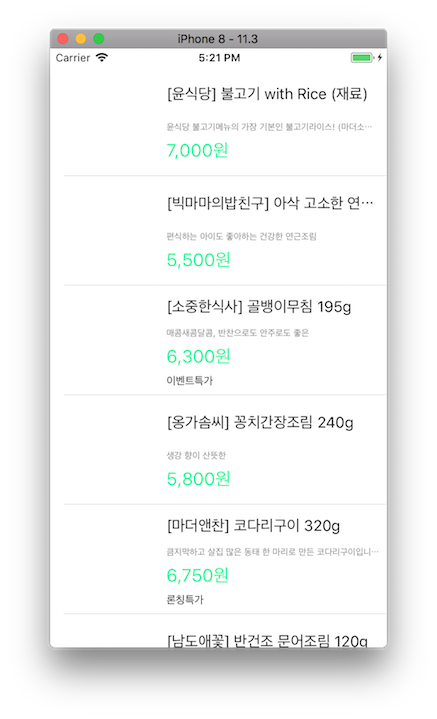
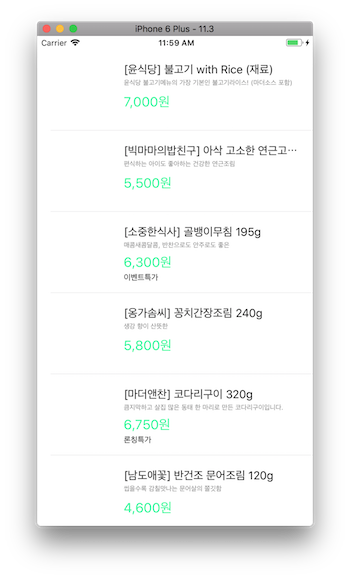
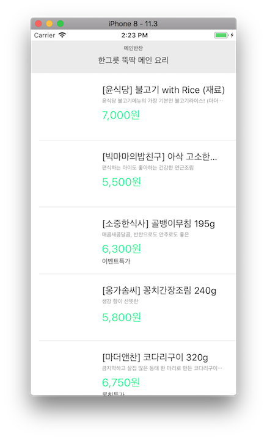
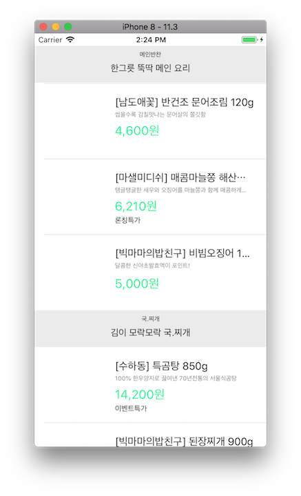
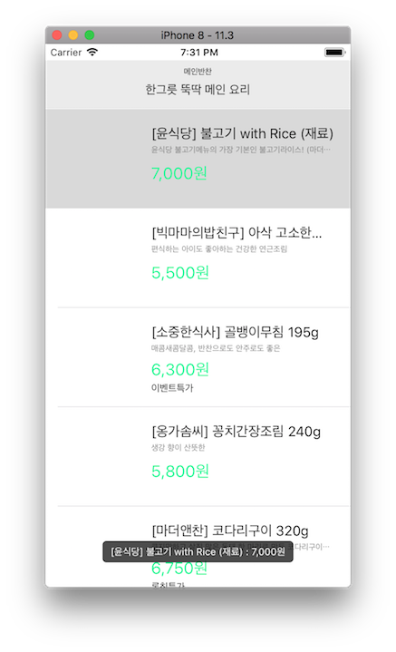
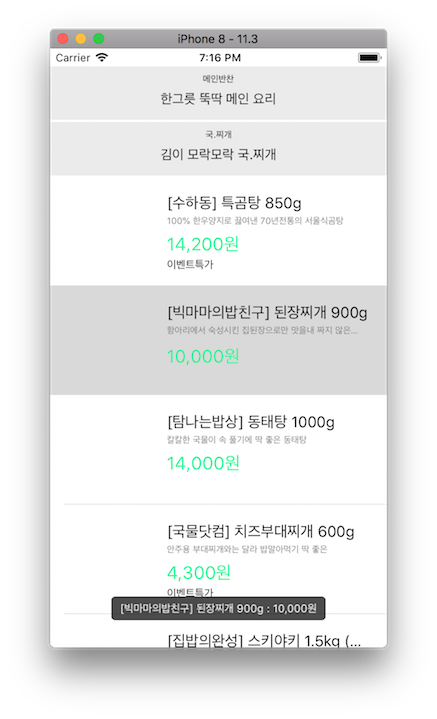
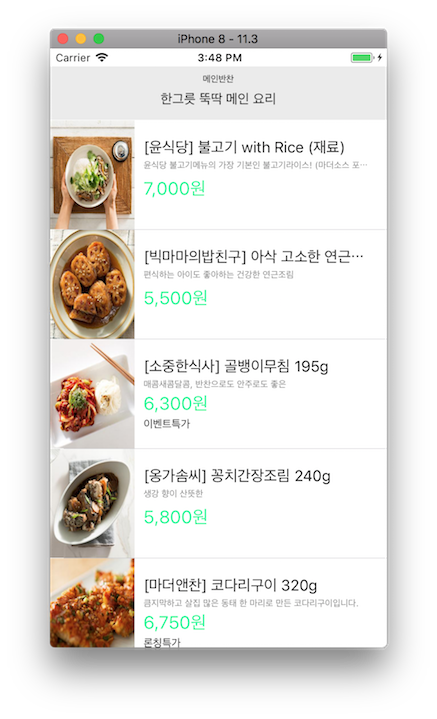
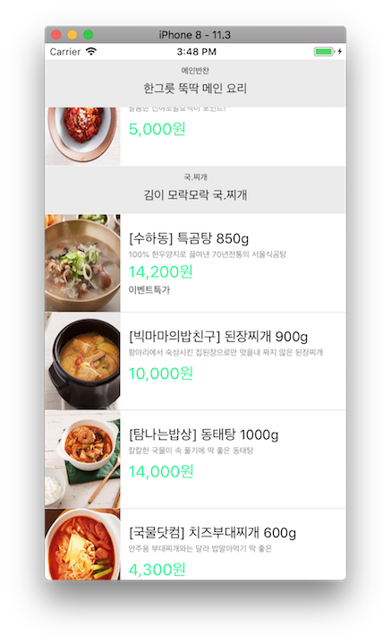
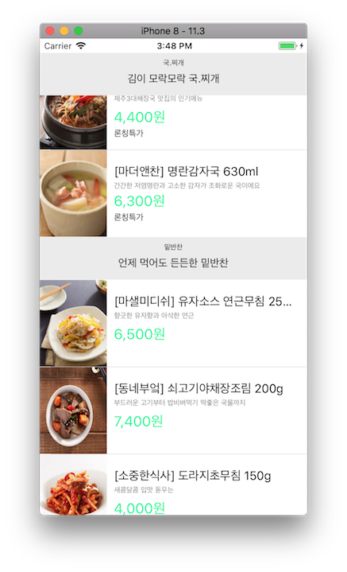
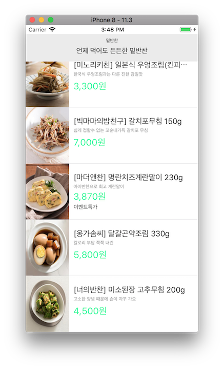

# 쇼핑 앱

## Step1 (시작하기 - 상품 목록)
### 요구사항
- iOS 프로젝트 Single View App 템플릿으로 하고 프로젝트 이름을 "StoreApp"으로 지정하고, 위에 만든 로컬 저장소 경로에 생성한다.
- 기본 상태로 아이폰 8 시뮬레이터를 골라서 실행한다.
- readme.md 파일을 자신의 프로젝트에 대한 설명으로 변경한다.
	- 단계별로 미션을 해결하고 리뷰를 받고나면 readme.md 파일에 주요 작업 내용(바뀐 화면 이미지, 핵심 기능 설명)과 완성 날짜시간을 기록한다.
	- 실행한 화면을 캡처해서 readme.md 파일에 포함한다.

### 프로그래밍 요구사항
- 스토리보드 ViewController에 TableView를 추가하고 Safe 영역에 가득 채우도록 frame을 설정한다.
- 테이블뷰에 새로운 프로토타입 Cell을 추가하고, Custom 스타일로 지정하고 다음과 같이 디자인한다.

- main.json 데이터 파일을 다운로드해서 프로젝트에 복사하고 JSONDecoder를 활용해서 내부에 Array<StoreItem> 타입으로 변환하는 DataSource에서 사용할 모델 객체를 만든다.
	- subscript로 배열에 index로 접근하면 StoreItem 구조체를 반환한다.
	- StoreItem은 Decodable 프로토콜을 채택하고, main.json에 있는 키와 값을 매핑해서 속성으로 갖도록 구현한다.
- UITableViewDataSource 프로토콜 구현 부분에서 cell을 위에서 만든 DataSource 모델 객체에 접근해서 테이블뷰를 표시한다.
	- 이미지뷰에 image는 아직 표시하지 않는다.

### 결과
#### UI


---
## Step2 (오토레이아웃 AutoLayout 적용)
### 요구사항
- 오토레이아웃 방식에 대해 학습하고 여러 종류 아이폰 화면에서 모두 보이도록 대응하는 UI를 완성하는 것을 목표로 한다.
- readme.md 파일을 자신의 프로젝트에 대한 설명으로 변경한다.
	- 단계별로 미션을 해결하고 리뷰를 받고나면 readme.md 파일에 주요 작업 내용(바뀐 화면 이미지, 핵심 기능 설명)과 완성 날짜시간을 기록한다.
	- 실행한 화면을 캡처해서 readme.md 파일에 포함한다.

### 프로그래밍 요구사항
- 스토리보드 ViewController에 Cell을 Content View를 기준으로 하위 뷰들에 오토레이아웃을 적용한다.
	- 메뉴 이미지 뷰는 top, bottom, lead 제약을 주고 width 제약을 넣는다. height와 width 비율은 1:1로 aspectRatio를 맞춘다.
	- 타이틀 제목은 메뉴 이미지보다 10pt 우측에 lead 제약을 주고, top, tail 제약을 주고, height 제약을 준다.
	- 상세 설명도 top 제약만 타이틀 제목보다 4pt 띄우고, 나머지는 타이틀에 맞춘다.
	- 메뉴 가격도 width 제약을 넣고, 나머지는 타이틀과 마찬가지로 제약을 준다.
	- 이벤트 배지는 최소width 제약만 주고 글자 내용에 맞추고, 없을 경우 감춘다.
- 모든 아이폰 사이즈에 대응해서 잘리는 화면이 없이 나와야 한다.
	- 아이폰 5s, 6,7,8 계열, 6+, 7+, 8+계열과 아이폰 X 모두 정상적으로 화면이 나오는지 확인한다.

### 결과
#### UI





---
## Step3 (Custom Section 헤더 적용)
### 요구사항
- 데이터를 추가하고 오토레이아웃을 적용한 상품목록 - 테이블뷰를 완성하는 것을 목표로 한다.
- readme.md 파일을 자신의 프로젝트에 대한 설명으로 변경한다.
	- 단계별로 미션을 해결하고 리뷰를 받고나면 readme.md 파일에 주요 작업 내용(바뀐 화면 이미지, 핵심 기능 설명)과 완성 날짜시간을 기록한다.
	- 실행한 화면을 캡처해서 readme.md 파일에 포함한다.

### 프로그래밍 요구사항
- soup.json, side.json 파일을 다운로드해서 프로젝트에 복사하고 JSONDecoder를 활용해서 모델 객체를 기존 main과 함께 섹션(section)을 구분할 수 있도록 개선한다.
- 스토리보드 ViewController에 Cell에 Section Header로 사용할 Custom Cell을 추가한다.
	- 총 섹션은 3개로 구분해서 헤더에 다음과 같이 표시한다.
	- main => ```메인반찬 / 한그릇 뚝딱 메인 요리```
	- soup => ```국.찌게 / 김이 모락모락 국.찌게```
	- side => ```밑반찬 / 언제 먹어도 든든한 밑반찬```

### 결과
#### UI




---
## Step4 (패키지 관리 - CocoaPod)
### 요구사항
- 쇼팽앱 섹션 헤더 적용 요구사항을 구현한 상태에서 시작한다.
- 패키지 의존성 관리 도구에 대해 학습하고 적용한다.
- Cocoapods에 대해 학습한다.
- readme.md 파일을 자신의 프로젝트에 대한 설명으로 변경한다.
	- 단계별로 미션을 해결하고 리뷰를 받고나면 readme.md 파일에 주요 작업 내용(바뀐 화면 이미지, 핵심 기능 설명)과 완성 날짜시간을 기록한다.
	- 실행한 화면을 캡처해서 readme.md 파일에 포함한다.

### 프로그래밍 요구사항
- Cocoapod 를 설치한다.
- https://github.com/devxoul/Toaster 저장소에 있는 Toaster 패키지를 cocoapod 으로 설치한다.
- pod으로 설치한 Toaster 모듈을 import 하고 테이블뷰 셀을 터치하면 (didSelect) 타이틀 메뉴와 (할인된)최종 가격 정보를 toast 형태로 표시한다.

### 결과
#### UI



---
## Step5 (Network 프로그래밍)
### 요구사항
- 네트워크 프로그래밍 관련 자료를 보고 학습한다.
- HTTP 프로토콜에 대해 학습하고 요청과 응답 방식에 대해 정리한다.
- 네트워크 프로그래밍을 위해서 Asynchronous 방식으로 동작하는 개념을 학습한다.
- readme.md 파일을 자신의 프로젝트에 대한 설명으로 변경한다.
	- 단계별로 미션을 해결하고 리뷰를 받고나면 readme.md 파일에 주요 작업 내용(바뀐 화면 이미지, 핵심 기능 설명)과 완성 날짜시간을 기록한다.
	- 실행한 화면을 캡처해서 readme.md 파일에 포함한다.

### 프로그래밍 요구사항
- 아래 주소별로 JSON 데이터를 받아오는 모델 객체를 만든다.
	- HTTP 프로토콜 GET 요청으로 다음 주소에서 메인반찬 JSON 데이터를 받는다. ```http://crong.codesquad.kr:8080/woowa/main```
	- HTTP 프로토콜 GET 요청으로 다음 주소에서 국.찌게 JSON 데이터를 받는다. ```http://crong.codesquad.kr:8080/woowa/soup```
	- HTTP 프로토콜 GET 요청으로 다음 주소에서 밑반찬 JSON 데이터를 받는다. ```http://crong.codesquad.kr:8080/woowa/side```
	(위 API들은 오전9시부터 밤12시까지만 동작한다.)
- HTTP 요청은 URLSession 관련 프레임워크를 활용한다.
- 응답으로 받은 JSON 데이터를 마찬가지 방법으로 Decode해서 StoreItem 객체로 변환한다.
- 모델 객체는 응답이 도착하면 Notification을 보내서 테이블뷰의 해당 섹션만 업데이트한다.

---
## Step6 (병렬처리)
### 요구사항
- GCD(Grand Central Dispatch)에 대해 학습하고 정리한다. 강의 자료
- 이미지 다운로드와 캐시 처리 방식에 대해 학습한다.
- readme.md 파일을 자신의 프로젝트에 대한 설명으로 변경한다.
	- 단계별로 미션을 해결하고 리뷰를 받고나면 readme.md 파일에 주요 작업 내용(바뀐 화면 이미지, 핵심 기능 설명)과 완성 날짜시간을 기록한다.
	- 실행한 화면을 캡처해서 readme.md 파일에 포함한다.

### 프로그래밍 요구사항
- 3개의 JSON 데이터가 모두 받고 나면 JSON 데이터에 포함된 이미지 URL을 분리해서 Image 파일들을 다운로드 받는다.
	- 이미지 파일들을 병렬처리해서 한꺼번에 여러개를 다운로드하도록 구성한다.
	- (선택1) GCD Queue를 활용하거나
	- (선택2) Download Task 방식으로 구현한다.
- 다운로드가 완료되면 앱 디렉토리 중에 Cache 디렉토리에 URL에 있는 파일명으로 저장한다.
- 셀을 표기할 때 이미 다운로드된 이미지가 있으면 표시하고, 새로운 파일이 다운로드 완료되면 해당 이미지를 테이블뷰 셀에 뒤늦게(lazy) 표시한다.
	- 화면에 표시할 때 다운로드를 담당하는 스레드와 화면을 처리하는 스레드를 위한 GCD Queue를 구분해서 처리한다.
	- 이미지를 다 받을때 까지 화면이 하얗게 멈춰있지 않도록 만든다.

### 결과
#### UI





---
## 중간에 고생했던 부분 / 기억할 부분 간단 정리
- JSONDecoder().decode([StoreItem].self, from: data) 를 통해 데이터를 직접 객체에 바인딩 가능하다.
- 위 코드를 Swift 4.1 새로 추가된 내용에 의해 변경
```
let decoder = JSONDecoder()
decoder.keyDecodingStrategy = .convertFromSnakeCase
return try decoder.decode([StoreItem].self, from: data)
```
가운데 줄의 ```decoder.keyDecodingStrategy = .convertFromSnakeCase``` 가 새로 추가된 부분.
JSON데이터의 snakeCase형식의 키를 camelCase로 자동으로 커스터마이징 해준다.
- UITableViewDelegate 과 UITableViewDatasource
```
UITableViewDelegate
Serving as a table's delegate means you provide answers to requests about the layout of the table and about actions the user performs on the tableview. Layout methods include the tableview asking about the height of rows, headers, and footers, what the buttons should look like, etc. Action methods include the user selecting a row and beginning and ending the editing of a row.
   
UITableViewDatasource
Serving as a table's datasource means you provide data for the sections and rows of a table and you act on messages that change a table's data. The datasource is asked for the data for a cell when the table is drawn, is told that the user has asked to delete a row, and is told the new value of a row that the user has edited.
```
	- Delegate의 경우 action이나 TableView의 속성 등을 사용자의 요구에 맞게 표현하도록 하는 프로토콜
	- DataSource의 경우 모델 등 데이터를 TableView에 표현하기 위한 프로토콜
 - 패키지 매니저 도구
 	- CocoaPods
		+ 장점 : 설치 및 사용이 쉽고, 커뮤니티가 크고 활발하다.(대부분의 오픈소스가 포함되어있음)
		+ 단점 : 프로젝트 내용 및 파일을 자동으로 알지 못하는 방향으로 수정하는 경우가 있다.
	- Carthage
		+ 장점 : 프로젝트를 건들지 않아 정확한 컨트롤이 가능하다.
		+ 단점 : 느리고, 커뮤니티가 크지 않다.
	- Swift Package Manager
		+ 장점 : Apple에서 공식 지원한다.
		+ 단점 : 초창기, 표준 Swift Package의 Directory 구조를 따라야 한다.
- 프로젝트 설정 관련 용어
	+ target
	+ workspace
	+ build configuration
	+ scheme
- URLSession : iOS네트워킹을 담당하는 객체.(Foundation)
	- Configuration에 따라 인스턴스를 생성할지, shared를 이용한 싱글톤 객체를 사용할지 지정할 수 있다. 
	- dataTask메소드와 URL혹은 URLRequest를 이용하여 커스터마이징해서 네트워크 작업을 진행할 수 있다.
	- HTTP통신을 위해선(HTTPS가 아닌 경우) App Transport Security Settings - Allow Arbitrary Loads 를 YES로 설정해야한다. 
- Alamofire : 네트워크 작업을 쉽게 처리하도록 도와주는 라이브러리
	- 편리한 기능들이 많아서 인기가 많다.
	- [Alamofire](https://github.com/Alamofire/Alamofire)
- UITableView의 insertRows, deleteRows
	- 업데이트 하려는 데이터의 rows count와 업데이트 후 tableView의 해당 셀의 rows가 같아야 한다.
	- 비동기처리 작업시 주의 : tableView 업데이트 순간에 데이터의 모든 section과 rows count가 일치해야한다.(데이터 먼저 다 받고 tableView 따로 그리고 그런 방식이 아니라 데이터가 수정되는 것과 테이블 뷰 그리는 과정이 동기화 되어야 한다.)
- 병렬처리(Parallel Processing)와 동시성(Concurrency)
	- GCD(Grand Central Dispatch)
	- DispatchQueue를 이용해 새로운 쓰레드를 만든다고 생각하면 됨
	- qos(Quality Of Service)를 이용해 처리 방식을 설정 가능
	- UI는 항상 main쓰레드에서 처리해야 한다.
- GCD & NSOperation
	+ GCD
		- low-level C API
		- light-weight
	+ NSOperation
		- Objective-C API
		- Key-Value 형식이라 Observable함(KVO)
		- Pause, Cancel, Resume 등 컨트롤 가능
		- State확인 가능
		- Max Number로 쓰레드 갯수 제한 가능
	- 둘은 병행해서 필요에 의해 사용하는 것이 좋다.
	- 세밀한 컨트롤이 필요할때와 간단하고 가볍게 사용할때를 구분해서 사용하면 좋을 것 같다.
	- 이 프로젝트에선 downloadTask를 이용해 파일을 바로 다운받아서 데이터 활용에 이익을 취할 수 있었다.
	- GCD를 활용했다면 파일을 Data형식으로 다운받고 다시한번 jpg파일로 전환하는 작업이 필요하여 파일 용량과 로직이 불합리적이었을 것이다.
